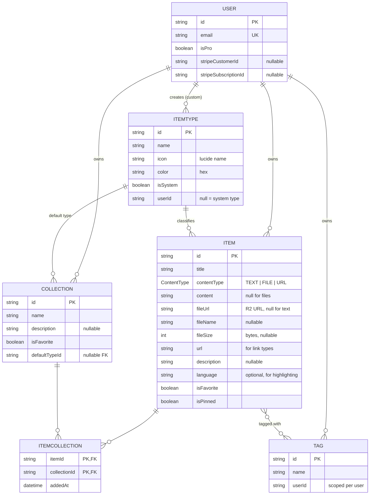
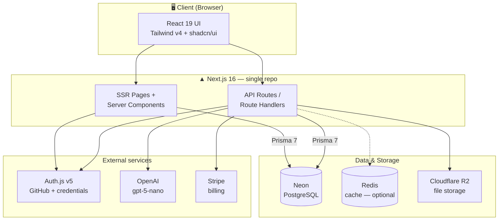
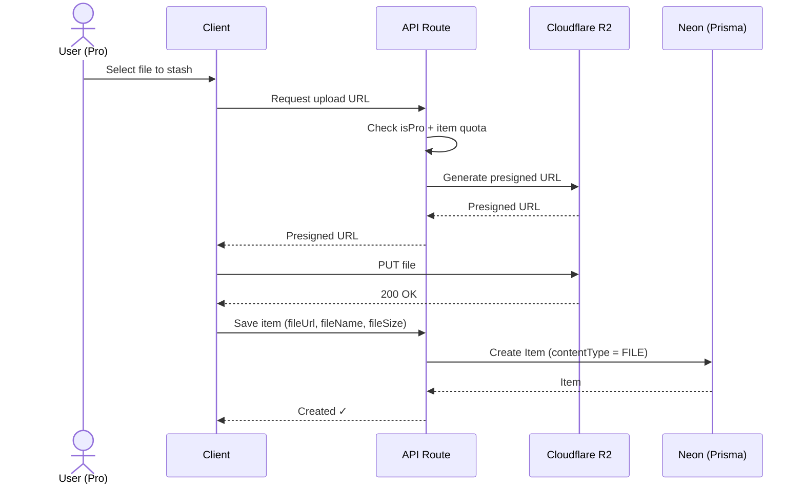

# 📦 DevStash — Project Overview

> **One fast, searchable, AI-enhanced hub for all of a developer's knowledge & resources.**
> Snippets, prompts, commands, notes, links, and files — stashed in one place instead of scattered across VS Code, Notion, chats, bookmarks, gists, and `bash_history`.

**Status:** Planning / pre-build
**Type:** Freemium SaaS
**Stack (short):** Next.js 16 · React 19 · TypeScript · Prisma 7 · Neon Postgres · Cloudflare R2 · Auth.js v5 · Tailwind v4 + shadcn/ui · OpenAI

---

## Table of Contents

1. [Problem](#1-problem)
2. [Target Users](#2-target-users)
3. [Features](#3-features)
4. [Data Model](#4-data-model)
   - [Entity-Relationship Diagram](#41-entity-relationship-diagram)
   - [Prisma Schema](#42-prisma-schema)
   - [Design Notes & Open Decisions](#43-design-notes--open-decisions)
5. [Architecture](#5-architecture)
6. [Tech Stack](#6-tech-stack)
7. [Monetization](#7-monetization)
8. [UI / UX](#8-ui--ux)
9. [Type Colors & Icons](#9-type-colors--icons)
10. [Suggested Build Order](#10-suggested-build-order)

---

## 1. Problem

Developers keep their essentials scattered across too many places:

| Where it lives now | What it is |
| --- | --- |
| VS Code / Notion | Code snippets |
| AI chats | Prompts, system messages |
| Random project folders | Context files, docs |
| Browser bookmarks | Useful links |
| `.txt` files | Commands |
| GitHub Gists | Project templates, boilerplates |
| `bash_history` | Terminal commands |

This causes **context switching**, **lost knowledge**, and **inconsistent workflows**. DevStash consolidates all of it into a single fast, searchable, AI-enhanced hub.

---

## 2. Target Users

- **Everyday Developer** — needs a fast way to grab snippets, prompts, commands, and links.
- **AI-first Developer** — saves prompts, contexts, workflows, and system messages.
- **Content Creator / Educator** — stores code blocks, explanations, and course notes.
- **Full-stack Builder** — collects patterns, boilerplates, and API examples.

---

## 3. Features

### A. Items & Item Types

Every stashed thing is an **Item** with a **type**. Users can create custom types later (Pro), but we ship with these **system types** (immutable):

| Type | Content kind | Availability |
| --- | --- | --- |
| `snippet` | text | Free |
| `prompt` | text | Free |
| `note` | text | Free |
| `command` | text | Free |
| `link` | url | Free |
| `file` | file | **Pro** |
| `image` | file | **Pro** |

- A type resolves to one of three content kinds: **text** (snippet, note, prompt, command), **url** (link), or **file** (file, image).
- Type-scoped list routes look like `/items/snippets`, `/items/commands`, etc.
- Items are quick to create and open inside a **drawer**.

### B. Collections

- Users create **collections** that can hold items of **any type**.
- An item can belong to **multiple collections** (e.g. a React snippet in both *React Patterns* and *Interview Prep*) — handled via a join table.
- Examples: *React Patterns* (snippets, notes), *Context Files* (files), *Python Snippets* (snippets).

### C. Search

Powerful search across **content**, **tags**, **titles**, and **types**.

### D. Authentication

- Email / password
- GitHub OAuth

### E. Core Features

- ⭐ Favorite collections and items
- 📌 Pin items to top
- 🕘 Recently used
- 📥 Import code from a file
- ✍️ Markdown editor for text types
- 📎 File upload for file/image types
- 📤 Export data in multiple formats
- 🌙 Dark mode (default for devs) + optional light mode
- 🔀 Add/remove items to/from multiple collections
- 🔎 View which collections an item belongs to

### F. AI Features — *Pro only*

- 🏷️ AI auto-tag suggestions
- 📝 AI summaries
- 💡 "Explain this code"
- ✨ Prompt optimizer

---

## 4. Data Model

> This is a working model — refined from the original rough notes. Not set in stone.

### 4.1 Entity-Relationship Diagram



### 4.2 Prisma Schema

> ⚠️ **Migrations only.** Never use `prisma db push` or edit the DB structure directly. Create migrations, run them in **dev**, then in **prod**.
> Prisma 7 — [fetch the latest docs](https://www.prisma.io/docs) before generating the client.

```prisma
// prisma/schema.prisma

generator client {
  provider = "prisma-client-js"
}

datasource db {
  provider = "postgresql"
  url      = env("DATABASE_URL")
}

// ───────────────────────── Enums ─────────────────────────

enum ContentType {
  TEXT // payload in `content`
  FILE // payload in `fileUrl` / `fileName` / `fileSize`
  URL  // payload in `url` (link-type items)
}

// ───────────────────── App domain models ─────────────────

model User {
  id            String    @id @default(cuid())
  name          String?
  email         String    @unique
  emailVerified DateTime?
  image         String?

  // DevStash / billing
  isPro                Boolean @default(false)
  stripeCustomerId     String? @unique
  stripeSubscriptionId String? @unique

  // Relations
  items       Item[]
  collections Collection[]
  itemTypes   ItemType[] // user-created (custom) types
  tags        Tag[]

  // NextAuth
  accounts Account[]
  sessions Session[]

  createdAt DateTime @default(now())
  updatedAt DateTime @updatedAt
}

model Item {
  id          String      @id @default(cuid())
  title       String
  contentType ContentType @default(TEXT)
  content     String?     @db.Text // text body (TEXT); null otherwise
  fileUrl     String? // Cloudflare R2 URL (FILE); null otherwise
  fileName    String? // original filename
  fileSize    Int? // bytes
  url         String? // for link-type items
  description String?
  language    String? // optional, for code syntax highlighting
  isFavorite  Boolean     @default(false)
  isPinned    Boolean     @default(false)

  // Relations
  userId      String
  user        User             @relation(fields: [userId], references: [id], onDelete: Cascade)
  itemTypeId  String
  itemType    ItemType         @relation(fields: [itemTypeId], references: [id])
  tags        Tag[] // implicit many-to-many
  collections ItemCollection[]

  createdAt DateTime @default(now())
  updatedAt DateTime @updatedAt

  @@index([userId])
  @@index([itemTypeId])
}

model ItemType {
  id       String  @id @default(cuid())
  name     String
  icon     String // lucide icon name, e.g. "Code"
  color    String // hex, e.g. "#3b82f6"
  isSystem Boolean @default(false)

  // null for system types; set for user-created custom types
  userId String?
  user   User?   @relation(fields: [userId], references: [id], onDelete: Cascade)

  items                 Item[]
  defaultForCollections Collection[] @relation("CollectionDefaultType")

  @@unique([name, userId])
}

model Collection {
  id          String  @id @default(cuid())
  name        String
  description String?
  isFavorite  Boolean @default(false)

  // suggested type for new collections that have no items yet
  defaultTypeId String?
  defaultType   ItemType? @relation("CollectionDefaultType", fields: [defaultTypeId], references: [id])

  userId String
  user   User   @relation(fields: [userId], references: [id], onDelete: Cascade)

  items ItemCollection[]

  createdAt DateTime @default(now())
  updatedAt DateTime @updatedAt

  @@index([userId])
}

// Join table — item ↔ collection (many-to-many with metadata)
model ItemCollection {
  itemId       String
  collectionId String
  addedAt      DateTime @default(now())

  item       Item       @relation(fields: [itemId], references: [id], onDelete: Cascade)
  collection Collection @relation(fields: [collectionId], references: [id], onDelete: Cascade)

  @@id([itemId, collectionId])
  @@index([collectionId])
}

model Tag {
  id   String @id @default(cuid())
  name String

  // scoped per user (see design notes)
  userId String?
  user   User?   @relation(fields: [userId], references: [id], onDelete: Cascade)

  items Item[] // implicit many-to-many

  @@unique([name, userId])
}

// ─────────────────── NextAuth / Auth.js v5 ───────────────────

model Account {
  id                String  @id @default(cuid())
  userId            String
  type              String
  provider          String
  providerAccountId String
  refresh_token     String? @db.Text
  access_token      String? @db.Text
  expires_at        Int?
  token_type        String?
  scope             String?
  id_token          String? @db.Text
  session_state     String?

  user User @relation(fields: [userId], references: [id], onDelete: Cascade)

  @@unique([provider, providerAccountId])
}

model Session {
  id           String   @id @default(cuid())
  sessionToken String   @unique
  userId       String
  expires      DateTime
  user         User     @relation(fields: [userId], references: [id], onDelete: Cascade)
}

model VerificationToken {
  identifier String
  token      String   @unique
  expires    DateTime

  @@unique([identifier, token])
}
```

### 4.3 Design Notes & Open Decisions

- **Tags are scoped per user** (`Tag.userId` + `@@unique([name, userId])`).
- **`ItemType.name` uniqueness** is scoped with `@@unique([name, userId])` so a user's custom type can't clash, while system types (`userId = null`) stay unique among themselves.
- **`onDelete: Cascade`** on user-owned relations so deleting a user cleanly removes their items, collections, tags, and custom types.
- **`ContentType` enum (`TEXT | FILE | URL`)** drives storage — it tells the code which field holds the payload, independent of the user-facing `itemType`: `TEXT` → `content`, `FILE` → `fileUrl`/`fileName`/`fileSize`, `URL` → `url` (link items). A dedicated `URL` value (instead of overloading `TEXT`) lets rendering/validation resolve the payload with a single `switch` on `contentType`, and gives future custom types a clean storage shape to map onto.
- **IDs use `cuid()`**
- **Quotas (50 items / 3 collections on Free)** are enforced in the API layer, not the schema. Foundation should be built now even though *all users get everything during development*.
- **System types are seeded** via a migration/seed script so they exist for every environment.

---

## 5. Architecture

Single Next.js repo handling both SSR pages and API routes, talking to Neon (Postgres) through Prisma, with R2 for files and external services for auth, AI, and billing.



**File upload flow (Pro):** presigned-URL pattern keeps large files off the API server.



---

## 6. Tech Stack

| Layer | Choice | Docs |
| --- | --- | --- |
| Framework | Next.js 16 (SSR + API routes, one repo) | [nextjs.org/docs](https://nextjs.org/docs) |
| UI runtime | React 19 | [react.dev](https://react.dev) |
| Language | TypeScript | [typescriptlang.org/docs](https://www.typescriptlang.org/docs) |
| ORM | Prisma 7 | [prisma.io/docs](https://www.prisma.io/docs) |
| Database | Neon — serverless PostgreSQL | [neon.tech/docs](https://neon.tech/docs) · [postgresql.org/docs](https://www.postgresql.org/docs) |
| Cache *(maybe)* | Redis | [redis.io/docs](https://redis.io/docs) |
| File storage | Cloudflare R2 | [developers.cloudflare.com/r2](https://developers.cloudflare.com/r2/) |
| Auth | NextAuth / Auth.js v5 (email+password, GitHub OAuth) | [authjs.dev](https://authjs.dev) |
| AI | OpenAI — `gpt-5-nano` | [platform.openai.com/docs](https://platform.openai.com/docs) |
| Styling | Tailwind CSS v4 | [tailwindcss.com/docs](https://tailwindcss.com/docs) |
| Components | shadcn/ui | [ui.shadcn.com](https://ui.shadcn.com) |
| Billing | Stripe | [docs.stripe.com](https://docs.stripe.com) |

> **DB rule:** never `db push` or hand-edit the schema in the database — **migrations only**, dev → prod.

---

## 7. Monetization

Freemium. Build the Pro foundation now, but **during development every user can access everything.**

| | **Free** | **Pro — $8/mo or $72/yr** |
| --- | --- | --- |
| Items | 50 total | Unlimited |
| Collections | 3 | Unlimited |
| System types | All except file/image | All |
| File & image uploads | ❌ | ✅ |
| Custom types | ❌ | ✅ *(later)* |
| Search | Basic | Basic |
| AI auto-tagging | ❌ | ✅ |
| AI code explanation | ❌ | ✅ |
| AI prompt optimizer | ❌ | ✅ |
| AI summaries | ❌ | ✅ |
| Export (JSON / ZIP) | ❌ | ✅ |
| Support | Standard | Priority |

---

## 8. UI / UX

**General**

- Modern, minimal, developer-focused.
- Dark mode by default; light mode optional.
- Clean typography, generous whitespace, subtle borders and shadows.
- Syntax highlighting for code blocks.
- **References:** Notion · Linear · Raycast.

**Layout**

- Sidebar + main content (collapsible sidebar).
- **Sidebar:** item types linking to their lists (Snippets, Commands, …) + latest collections.
- **Main:** grid of color-coded **collection cards** (background color reflects the type they hold most of). Items render underneath as color-coded cards (**border** color = type). Individual items open in a quick-access **drawer**.

**Responsive**

- Desktop-first, mobile-usable. Sidebar becomes a drawer on mobile.

**Micro-interactions**

- Smooth transitions, hover states on cards, toast notifications for actions, loading skeletons.

---

## 9. Type Colors & Icons

Icons are [lucide](https://lucide.dev/icons) names. Colors are used for card backgrounds (collections) and card borders (items).

| Swatch | Type | Hex | Lucide Icon | Kind | Route |
| :---: | --- | --- | --- | --- | --- |
| 🔵 | Snippet | `#3b82f6` | `Code` | text | `/items/snippets` |
| 🟣 | Prompt | `#8b5cf6` | `Sparkles` | text | `/items/prompts` |
| 🟠 | Command | `#f97316` | `Terminal` | text | `/items/commands` |
| 🟡 | Note | `#fde047` | `StickyNote` | text | `/items/notes` |
| ⚪ | File | `#6b7280` | `File` | file | `/items/files` |
| 🩷 | Image | `#ec4899` | `Image` | file | `/items/images` |
| 🟢 | Link | `#10b981` | `Link` | url | `/items/links` |

---

## 10. Suggested Build Order

A pragmatic sequence to reach a usable MVP fast (not from your notes — a suggestion):

1. **Foundation** — Next.js 16 + TypeScript + Tailwind v4 + shadcn/ui; Neon + Prisma; initial migration; seed system `ItemType`s.
2. **Auth** — Auth.js v5 with GitHub OAuth + credentials; `User` model wired up.
3. **Items CRUD** — create/read/update/delete text items in the drawer; Markdown editor + syntax highlighting.
4. **Collections** — CRUD + `ItemCollection` join; add/remove items across collections; collection & item views.
5. **Search** — content, tags, titles, types.
6. **Polish** — favorites, pinning, recently used, dark/light mode, toasts, skeletons, responsive drawer.
7. **Files (Pro path)** — R2 presigned uploads for `file`/`image` types.
8. **Billing** — Stripe checkout + webhooks; `isPro` gating (keep everything open in dev).
9. **AI (Pro)** — auto-tagging, summaries, explain-code, prompt optimizer via `gpt-5-nano`.
10. **Export** — JSON / ZIP.

---

*Generated from planning notes — refined, de-duplicated, and formatted. Data model and build order are proposals; adjust freely.*